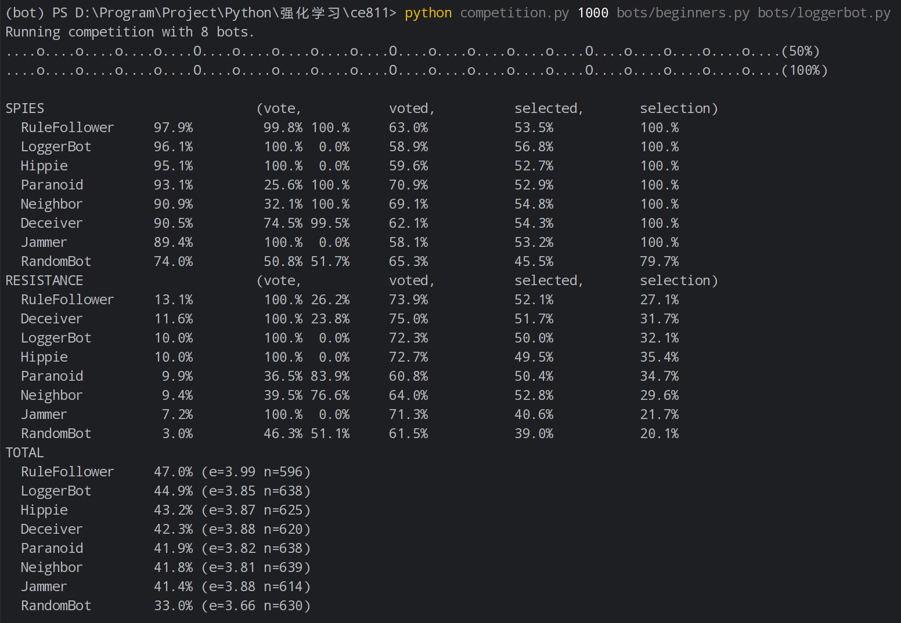
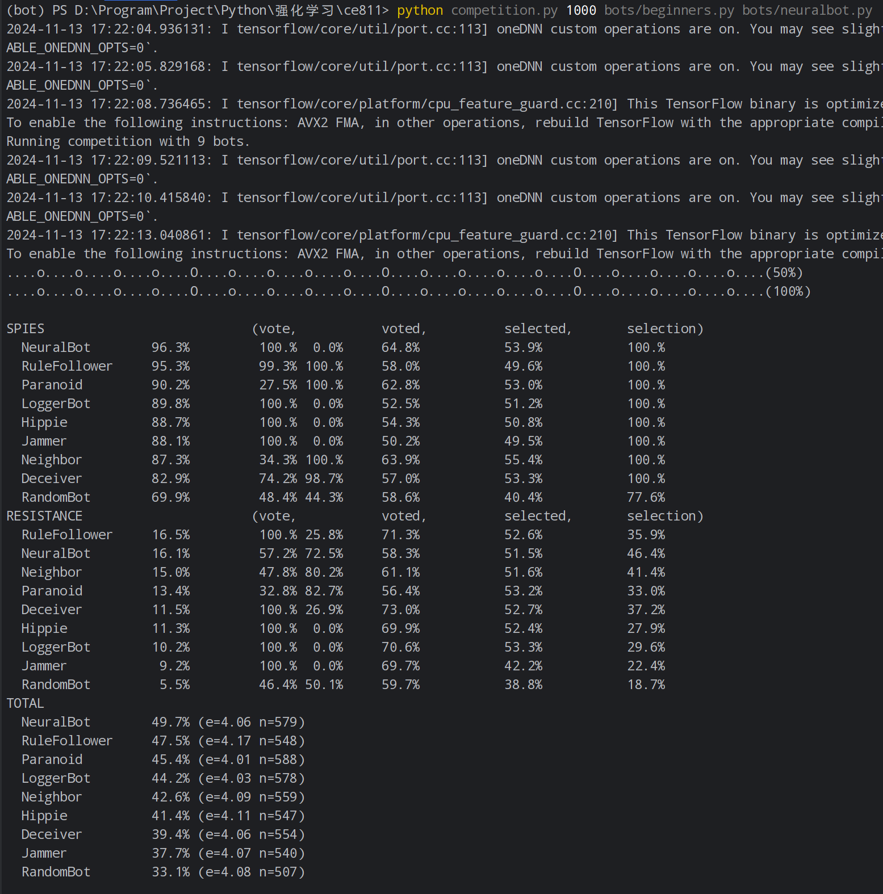

## **NeuralBot Report Framework**

### 1. **NeuralBot Input and Output Features**

#### Input Features:

- **Input Layer Features**: Information extracted from the game environment, which may include:
    - Current game state (such as player position, health, resources, history of actions, etc.).
    - Game rules or strategy state.
- **Input Dimensions**: It is assumed to be a fixed-length vector that includes all state variables.

#### Output Features:

- **Output Content**: The decision or action predicted by the neural network, typically:
    - A probability distribution indicating the likelihood of taking a specific action.
- **Output Dimensions**: Dependent on the action space size, it could be a probability vector as long as the action
  space.

### 2. **Improvements to NeuralBot**

#### Improvement Directions:

- **Reinforcement Learning Algorithms**:
    - Based on Lab 4, improve the neural network training process (e.g., by using more complex optimization methods,
      modifying reward strategies, or introducing new network architectures) to enhance classification accuracy and
      strategy performance.
- **Network Architecture Optimization**:
    - Increase the number of layers in the neural network, use different activation functions, or apply regularization
      methods to improve the model's learning capacity.
- **Training Data Expansion**:
    - Increase the amount of training data or use data augmentation techniques to improve the model's generalization
      ability.

#### Experimental Results:

- In the improved version, NeuralBot performs more consistently against multiple opponents (such as `LoggerBot`,
  `Bounder`, etc.), with a significant increase in win rate and the probability of selecting the correct strategy.
    - **Results Against `Bounder`**:
        - The logs show that the improved NeuralBot achieved a higher win rate and better decision-making ability.
    - **Results Against `LoggerBot`**:
        - NeuralBot's performance against LoggerBot demonstrates its ability to perform better in complex matches.

### 3. **Experimental Data Display**

#### Quantification of Results:

- **Charts**:
    - Plot the win rate curve over the number of games to show performance across multiple matches.
    - Display win rate curves (e.g., for 1000 games) and other statistical information such as win-loss records for
      different strategies.

#### Comparison of Different Bots' Performance:

- **NeuralBot vs. LoggerBot**:
    - **LoggerBot Win Rate**: ~39.2%; **NeuralBot Win Rate**: ~49.7%.
- **NeuralBot vs. Bounder**:
    - **NeuralBot Win Rate Against Bounder**: ~48.9%.

### 4. **Screenshot Display**

- **LoggerBot vs. Beginners**:  
  
- **NeuralBot vs. Beginners**:  
  
- **LoggerBot vs. Intermediates**:  
  
- **NeuralBot vs. Intermediates**:  
  

- **LoggerBot vs. Bounder**:  
  

- **NeuralBot vs. Bounder**:  
  

### 5. **Conclusion and Future Directions**

- **NeuralBot's Improvement Effect**:
    - The improved NeuralBot significantly enhances the model's decision-making ability in complex matches and against
      high-difficulty opponents.

- **Future Optimization Directions**:
    - Future work can focus on further optimizing the neural network training process, introducing more diverse
      features, and exploring advanced reinforcement learning algorithms (such as DQN, PPO, etc.) to further improve
      performance.