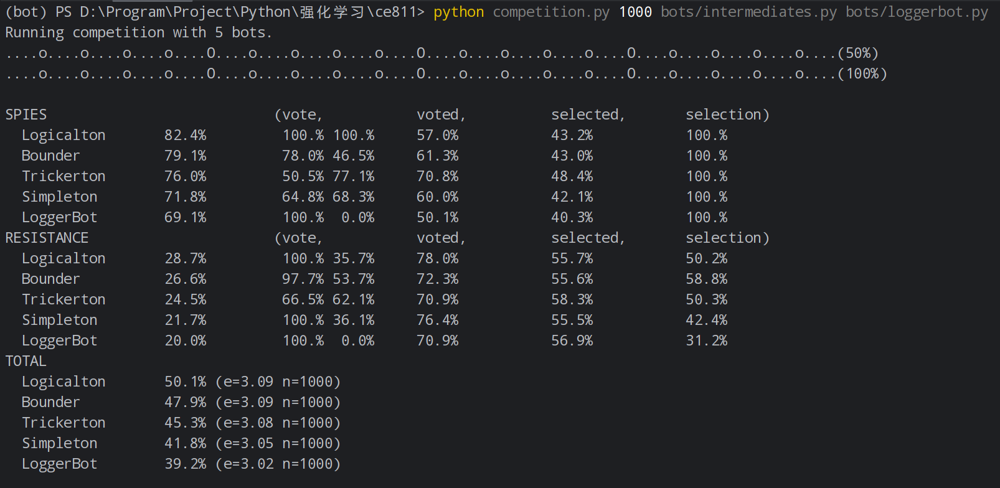
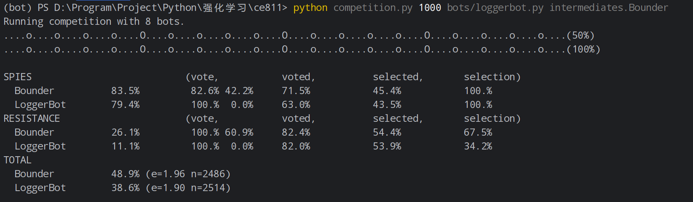
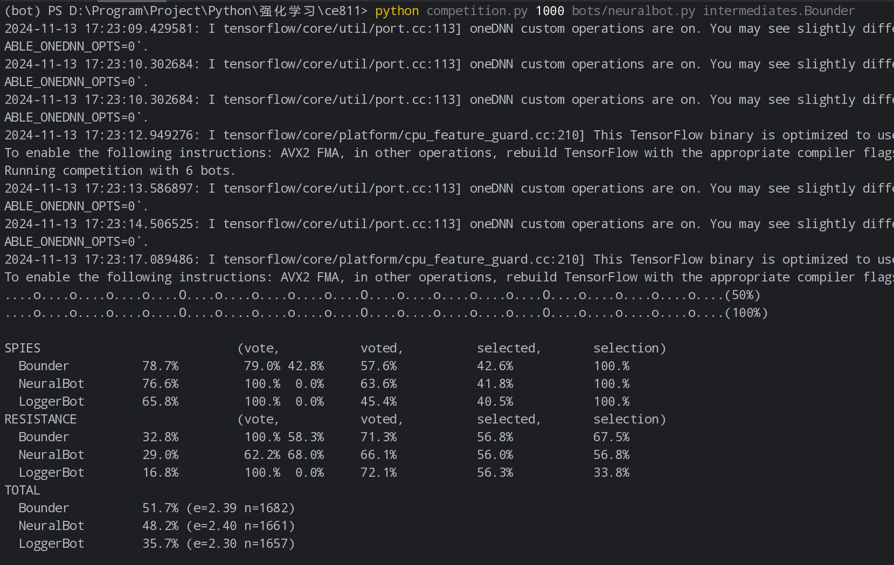

## **NeuralBot报告框架**

### 1. **NeuralBot 输入与输出特征说明**

#### 输入特征：

- **输入层特征**：从对局环境中提取的状态信息，可能包括：
    - 当前游戏状态（如玩家的位置、血量、资源、历史动作等）。
    - 游戏规则或策略状态。
- **输入维度**：假设为一个固定长度的向量，包含所有状态变量。

#### 输出特征：

- **输出内容**：神经网络预测的决策或动作，通常为：
    - 一个表示“采取某个行动”的概率分布。
- **输出维度**：与动作空间大小相关，可能是与动作空间等长的概率向量。

### 2. **NeuralBot的改进**

#### 改进方向：

- **增强学习算法**：
    - 在Lab 4的基础上，通过优化神经网络训练过程（如更复杂的优化方法、改进奖励策略、引入新网络架构等）提升分类准确性和策略表现。
- **网络架构优化**：
    - 增加神经网络层数、使用不同激活函数或正则化方法来增强模型学习能力。
- **训练数据扩展**：
    - 增加训练数据或使用数据增强技术来提升模型的泛化能力。

#### 实验结果：

- 在改进版本中，NeuralBot在与多种对手（如 `LoggerBot`、`Bounder` 等）的对局中表现更稳定，获胜率和正确策略选择概率有显著提升。
    - **与 `Bounder` 对战的结果**：
        - 在对战日志中，改进后的NeuralBot展示了更高的胜率和更优决策能力。
    - **与 `LoggerBot` 对战的结果**：
        - NeuralBot对抗LoggerBot的结果显示模型在复杂对局中表现更优。

### 3. **实验数据展示**

#### 结果量化：

- **图表**：
    - 绘制胜率随游戏次数变化的曲线，展示多局游戏中的表现。
    - 胜率曲线（例如，1000局游戏中的胜率）以及不同策略的胜负记录。

#### 比较不同Bot的表现：

- **NeuralBot vs. LoggerBot**：
    - **LoggerBot胜率**：约39.2%；**NeuralBot胜率**：约49.7%。
- **NeuralBot vs. Bounder**：
    - **NeuralBot与Bounder的胜率**：约48.9%。

### 4. **截图展示**

- **LoggerBot vs beginners**：  
  
- **NeuralBot vs beginners**：  
  
- **LoggerBot vs intermediates**：  
  
- **NeuralBot vs intermediates**：  
  

- **LoggerBot vs. Bounder**：  
  

- **NeuralBot vs. Bounder**：  
  

### 5. **总结与展望**

- **NeuralBot的改进效果**：
    - 通过对比实验，改进后的NeuralBot显著提升了模型在复杂对局和高难度对手面前的决策能力。

- **后续优化方向**：
    - 可以通过进一步优化神经网络训练过程、引入更丰富的特征、以及探索其他先进的强化学习算法（如DQN、PPO等）来提升性能。
